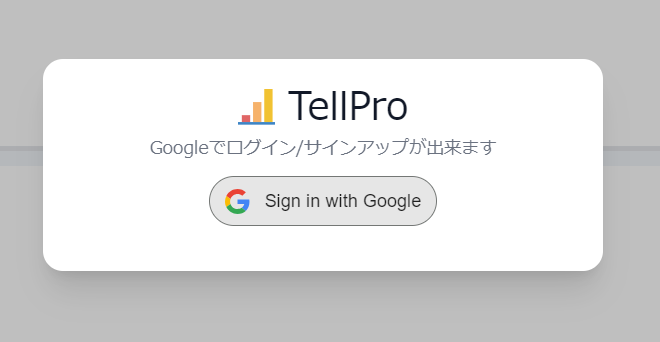

# できること
## アカウントの作成
GoogleアカウントでのSSOログインにより、パスワードを使用することなく安全に使用することができます  

右上のログインボタンを押して、の真ん中のボタンからグーグルログインをすると、自動でアカウントが存在するかを判別して、アカウント作成ページかホームに遷移します。

## TellProの機能
ログインしたら、自分のアイコンマークを押すことで様々な機能を使用できます。

できることに関しては、ProtoPediaのストーリー/機能紹介を参照ください。
[リンクはコチラ](https://protopedia.net/prototype/private/c61fe5d3-1bff-443f-947d-12a01abbe92d)